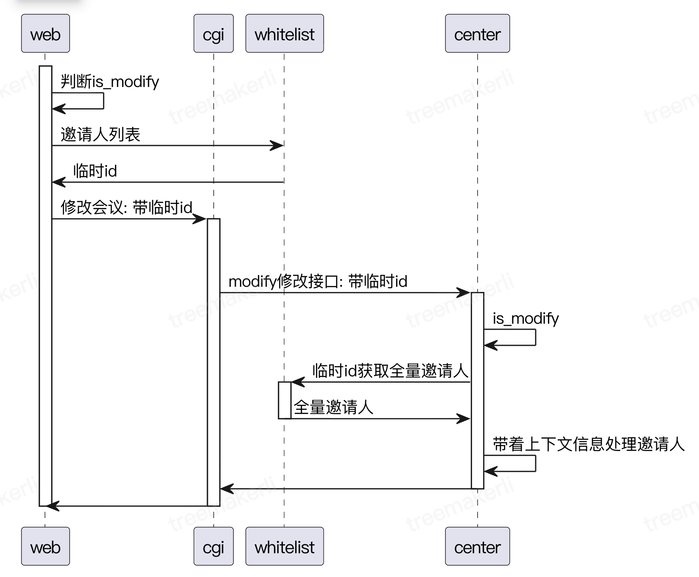

# web端修改会议邀请人

这里记录一个优化case

会议预订、修改时，大会场景下邀请人会超过千人，此时cgi -> center的rpc协议基于upd，会导致udp包体超限

优化方案是新增一个邀请人服务，走http协议存邀请人列表并映射一个临时id

这种设计叫引用分离

### 引用分离

将体积大、不频繁访问、或非核心业务逻辑依赖的数据，从主协议/消息/数据库表中剥离，用一个可寻址的引用（ID/Key/URL）来替代，数据本身单独存储在独立服务/存储系统中。