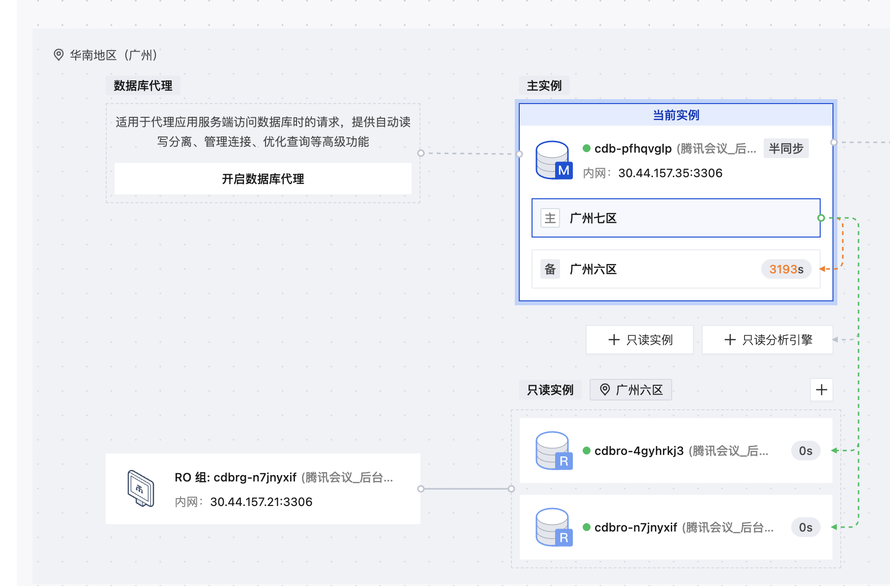

# 仪表盘数据库冷备导致主从延迟

- **来源日期：** 20260324
- **类型：** 数据库 / 案例

---

## 现象

白天出现仪表盘数据库主从延迟超过 3000s 的告警。

## 数据库架构

仪表盘为 **1主1备2只读** 架构，业务读走只读实例。

## 排查过程

1. 告警时间段内主从延迟距离不大，主库也没有大量写入
2. 数据库冷备时长为 1 小时（数据库磁盘占用达 4T）
3. 以前冷备时间点为早上 6 点，也触发过主从延迟超 3000s，但有告警策略屏蔽，未产生告警
4. 现冷备时间点变为早上 10 点，触发了告警
5. 冷备时间点变化原因：母机上迁来了一个大实例，底层调度冷备排队被排到后面

## 根因分析

**冷备时备库持有备份锁 → 主库 DDL → 备库同步 DDL 被阻塞 → 主库等待 ACK 超时降级（半同步机制）→ 主从延迟积累**

核心问题：
1. 数据库冷备时间长（数据规模大，4T）
2. 冷备时间从业务低峰（6点）漂移到业务高峰（10点）

## 影响评估

| 影响点 | 情况 |
|--------|------|
| 业务读 | **不影响**，读走只读实例 |
| 数据安全 | **有风险**，备库 SQL 回放被阻塞，主库挂掉时主从切换会丢数据 |

## 解决方案

| 方案 | 说明 | 优先级 |
|------|------|--------|
| 短期：调整冷备时间点 | 尽量避开白天，调回业务低峰期 | 高 |
| 中期：增加备库 | 改为 1主2备架构，提升容灾能力，但会增加成本 | 中 |
| 长期：拆库/拆表 | 减少单库数据量，降低冷备时长 | 低 |

## 结论

本次告警本质是冷备时间点漂移引发的已知问题，业务读不受影响。短期优先调整冷备时间点到业务低峰，长期需要拆库治理。
