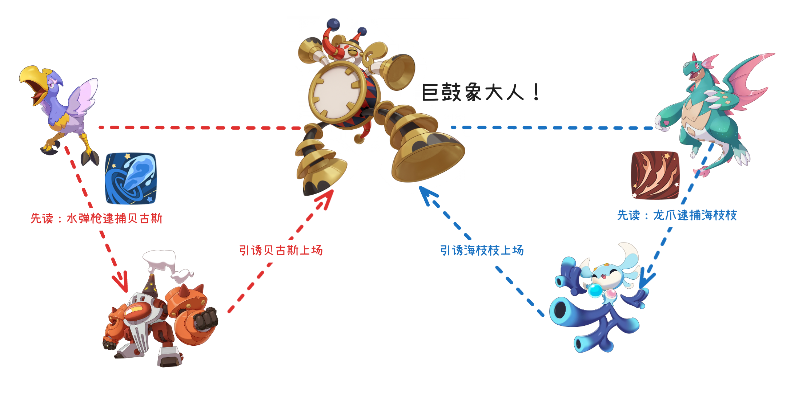
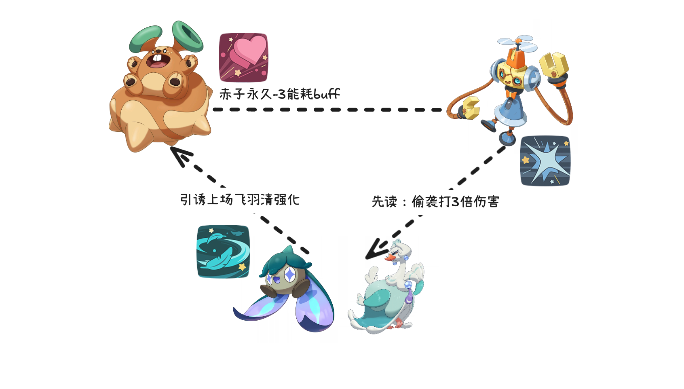
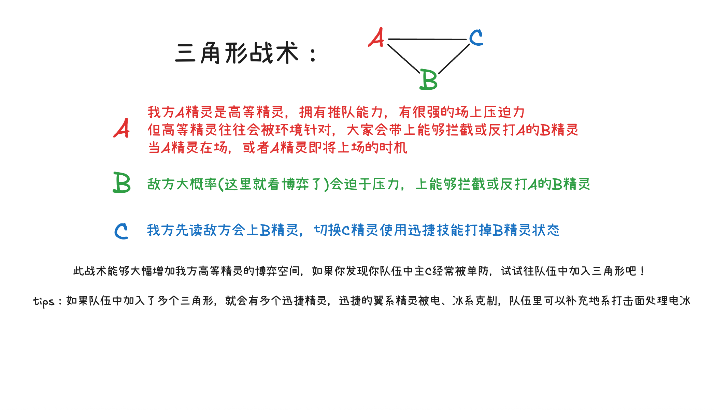
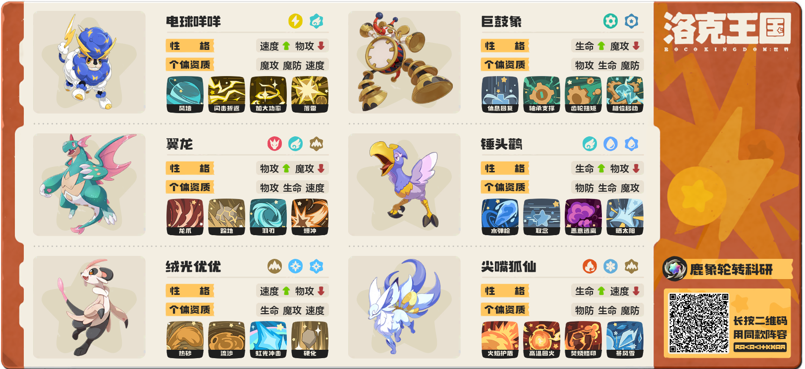

巨鼓象因为其超模的强度受到了很多小洛克的喜爱，但环境中人手一只针对精灵，发挥经常受限。
比如贝古斯、海枝枝都是拦截巨鼓象的好手，特别是海枝枝，只要对上巨鼓象就能获得巨大收益
up在高强度游玩巨鼓象，和贝古斯、海枝枝斗智斗勇的过程中，领悟出了一套三角形战术分享给大家。

我方巨鼓象在场，或者即将上场联防的回合。敌方大概率会换上针对精灵。
如果敌方后台是海枝枝，我方直接先读，切换翼龙打迅捷龙爪
如果敌方后台是贝古斯，我方也可以先读，切换锤头鹳打迅捷水弹枪

面对公式化打法的小洛克时，我们这套战术成功率极高，迅捷精灵消耗拦截精灵状态，给巨鼓象大人铺平道路
面对高水平选手时，我们也多了一层博弈空间，巨鼓象不至于被单防

上个赛季up分享的另一套阵容，也是这个思路
拥有赤子之心buff的蹦床松鼠，在场或即将上场的时机。
引诱敌方切换迅捷飞羽选手上场清强化。我方直接先读，切换帕帕斯卡使用迅捷偷袭打出3倍伤害

最后up把这套战术共性部分总结一下
我方A精灵是高等精灵，拥有推队能力，有很强的场上压迫力
但高等精灵往往会被环境针对，大家会带上能够拦截或反打A的B精灵
当A精灵在场，或者A精灵即将上场的时机

敌方大概率会迫于压力，换上能够拦截或反打A的B精灵

我方先读敌方会上B精灵，切换C精灵使用迅捷技能打掉B精灵状态

此战术能够大幅增加我方高等精灵的博弈空间，如果你发现你队伍中主C经常被单防，试试往队伍中加入三角形吧！

如果队伍中加入了多个三角形，就会有多个迅捷精灵，迅捷的翼系精灵被电、冰系克制，队伍里可以补充地系打击面处理电冰

# 鹿象轮转阵容(科研中)

1. 巨鼓象(普通血脉-休息回复): 主C (天敌贝古斯、海枝枝)
2. 锤头鹳(水血脉-水弹枪): 三角形迅捷水弹枪 -> 贝古斯
3. 翼龙(地血脉->跺地): 三角形迅捷龙爪 -> 海枝枝
4. 尖嘴狐仙(地血脉->处理电冰)
5. 绒光优优(光血脉-虹光冲击)
6. 电球咩咩(风血脉-风墙): 爵士鹿替代方案尝试中，感觉还可以