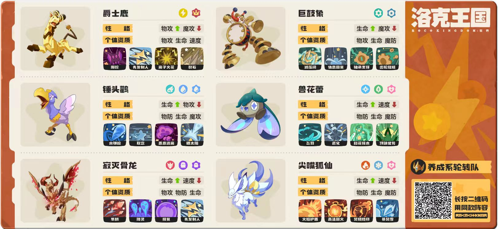
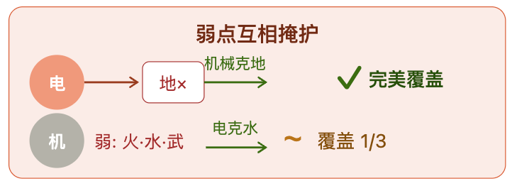
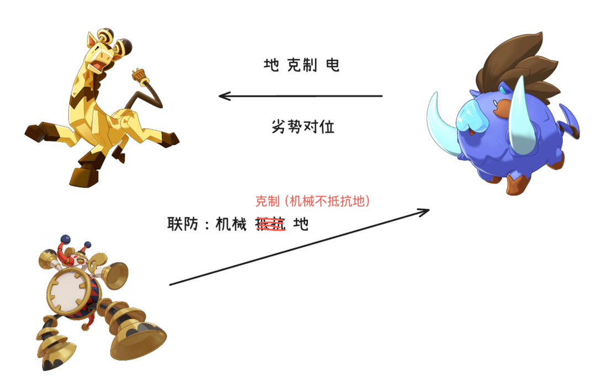
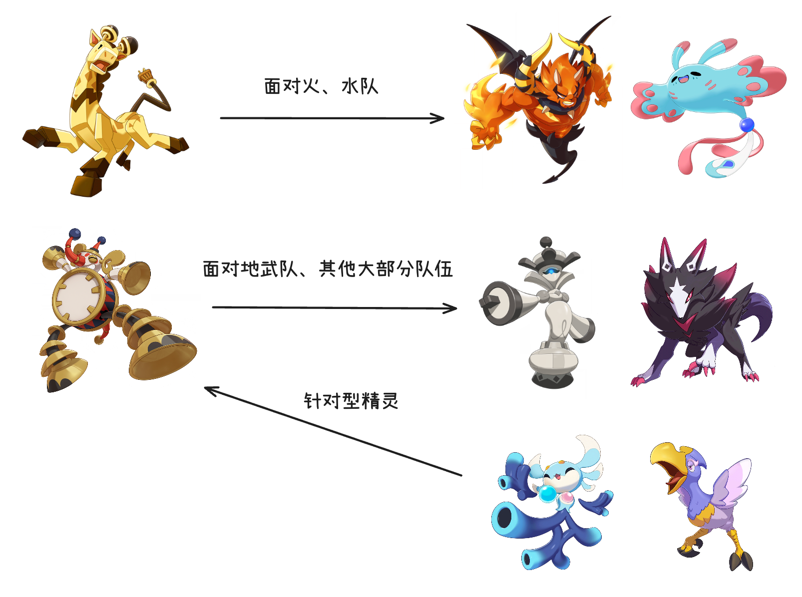
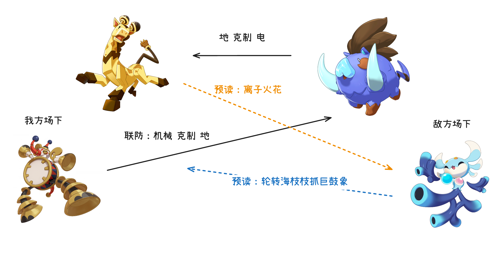
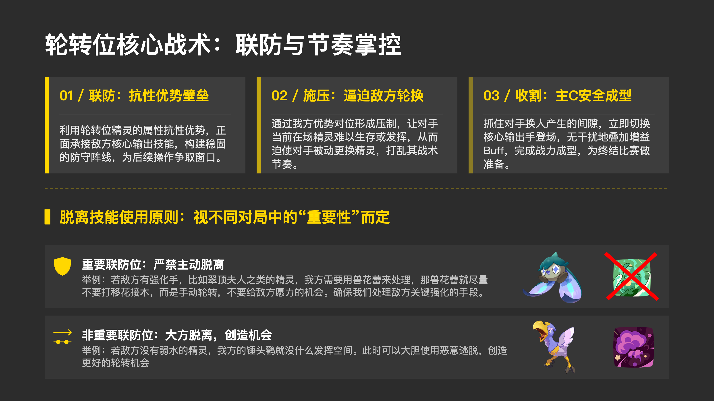

## 阵容

**主力** 

1. 爵士鹿(C位): 撕咬、离子火花、先发制人、裂石
2. 巨鼓象(C位): 减压阀、齿轮扭矩、休息回复、轴承支撑
3. 锤头鹳(轮转位): 水弹枪、借用、恶意逃离、晒太阳
4. 寂灭骨龙(轮转位): 隼鳞、降灵、先发制人、报复
5. 兽花蕾(轮转位): 飞羽、退化、移花接木、顶端优势
6. 尖嘴狐仙(轮转位): 高温回火、暴风雪、焚烧烙印、火焰护盾

**替补轮转位**

1. 魔力猫
2. 绒光优优
3. 翠顶夫人

**核心打法**

战略目标是让爵士鹿、巨鼓象尽可能多地安全入场，叠永久加成。

其余联防位均服务于双C，进行联防，针对不同场景，并且基本都携带脱离技能，提高轮转能力。

## 双C分析

**抵抗面**

电 + 机械 是比较互补的两个属性:

从抵抗面上来看，电系被地面系克制，而机械系可以克制地面系（机械系不抵抗地系）

这里我们引入一个最简单的预设场景：

爵士鹿 vs 獠牙猪，电被地系克制，我们处于劣势对位。
我们可以轮转巨鼓象上场，机械系克制地系，既能联防，又能叠加巨鼓象的齿轮扭矩威力。

**进攻面**

从进攻面上来看，电系和机械系的打击面没有重叠。
比如面对火队、水队我们就优先叠爵士鹿
面对地队以及其他大部分队伍，我们都可以优先叠巨鼓象。
巨鼓象虽然被武系克制，但武系精灵一般是物攻，巨鼓象物防极高，所以面对很多武系精灵我们也可以让巨鼓象来打。

巨鼓象因为强度很高很热门, 会有针对精灵，如海枝枝、锤头鹳
这2个精灵都是后手上场对到巨鼓象就能有巨大收益的，特别是海枝枝，一旦被敌方抓到和巨鼓象对位，处理不好甚至有可能被推队。
那我们的巨鼓象上场就要特别小心，尽量只上场叠齿轮，且用巨鼓象联防时也要小心敌方预读上海枝枝。

我们接着前面的预设场景继续推演：

爵士鹿 vs 獠牙猪，劣势对位。敌方场下有海枝枝。
我方切巨鼓象联防的收益很大，敌方可能预读直接轮转海枝枝来抓巨鼓象，我们也可以预读让爵士鹿打离子火花。
这里就是考验双方对于整体阵容的理解和博弈了，比如敌方除了海枝枝外是否还有其他拦截巨鼓象的手段，如果没有，那对方预读切海枝枝的风险就非常大，大概率就不敢出。
还有就是当前对局优劣势，敌方优势的情况下大概率求稳，劣势的情况下可能会做一些风险高收益大的行为。

这里也是我认为这套阵容值得分享的原因，这套阵容强行要求我们去理解对手的阵容思路，强行要求我们不断地基于双方场上场下的所有精灵来进行整体的阵容分析，
难度很高，但很能锻炼我们的分析、博弈能力，而随着我们训练家个人实力的不断提升，这套阵容的上限也会不断拔高。
可以形成一个训练家不断打磨实力，精灵也因为训练家的实力提升逐渐能够击败更强对手的正向循环，长期玩下来有一种养成系的快乐。

## 轮转位
接下来再说下轮转位

轮转位的基本使用就是联防，然后通过优势对位逼迫对手换人，我们利用这个机会轮转主C叠buff。
我们的轮转位基本都有脱离技能，脱离技能的使用上主要看联防位重要程度，重要联防位不打状态脱离；非重要联防位大方用，被愿力应对也不心疼，反而让我们的主C和重要联防位有更安全的环境。
举个例子，若敌方有强化位，比如翠顶夫人之类的精灵，我们需要兽花蕾来处理，那兽花蕾就尽量不要打脱离，手动轮转，不给敌方愿力应对的机会，确保我们处理关键强化的手段。
再举个例子，若敌方没有弱水精灵，锤头鹳就没什么发挥空间，此时我们可以大胆使用恶意逃脱，创造更好的轮转机会。

具体选择的话我目前用的是：

1. 锤头鹳：带迅捷水弹枪，克制c位的火系地系都能打
2. 兽花蕾：特性减双攻，带迅捷飞羽
3. 骨龙：拥有优秀抵抗面和特性，还有大威力隼鳞压迫敌方换人
4. 尖嘴狐仙：联防冰冻燃烧状态，倾斜位

替补：

魔力猫：看环境带，比如海枝枝多的情况我们可以带上猫，会相对好打一点
绒光优优、翠顶夫人也都是很适配的。

